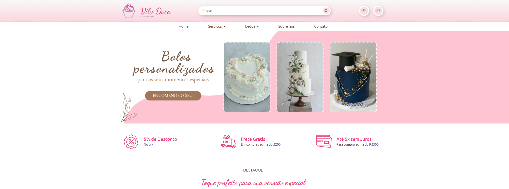

# 🧁 Vila Doce – Confeitaria

Projeto de site institucional para uma confeitaria fictícia, desenvolvido como meu **primeiro projeto concluído** após um período de estudos em **HTML, CSS e JavaScript**.

Este projeto tem um significado especial para mim, pois marcou a transição entre apenas estudar e **conseguir idealizar e finalizar algo do zero**, aplicando na prática tudo o que eu havia aprendido até então.

---

## 📷 Preview
## 🌐 Acesse o projeto online

🔗 [Clique aqui para visualizar o site](https://carolmontteiro.github.io/confeitaria)

---

## ✨ Sobre o projeto

O **Vila Doce** foi pensado para representar uma confeitaria delicada, acolhedora e moderna, com foco em produtos personalizados para momentos especiais, como festas, datas comemorativas e encomendas sob medida.

Todo o **design foi criado por mim**, desde a escolha das cores, tipografia, estilo visual até a criação da logo.  
Busquei inspirações visuais na internet, mas todas as decisões de identidade visual foram autorais.

As imagens utilizadas foram retiradas do **Pinterest** e de **bancos de imagens gratuitos**, apenas para fins de estudo e demonstração.

---

## 🎨 Design e identidade visual

- Paleta de cores suaves, com predominância de tons rosados
- Tipografia delicada para reforçar a identidade artesanal da marca
- Layout pensado para transmitir leveza, doçura e organização
- Logo criada exclusivamente para o projeto

---

## 🛠️ Tecnologias utilizadas

- HTML5
- CSS3 (puro, sem frameworks)
- JavaScript (interações básicas)
- Layout responsivo (Mobile First)

---

## 🚀 Aprendizados

Com este projeto, pude:

- Consolidar a base de **HTML semântico**
- Praticar **CSS puro**, incluindo posicionamento, cores e tipografia
- Aplicar conceitos iniciais de **JavaScript**
- Entender melhor o processo de criação de um projeto completo
- Desenvolver noções de design e identidade visual

---

## 📂 Status do projeto

✅ **Concluído**  
Este projeto não tem fins comerciais e foi desenvolvido exclusivamente para **aprendizado e portfólio**.

---

## 💖 Considerações finais

Este foi meu primeiro projeto finalizado de forma independente e, por isso, tenho um carinho enorme por ele.  
Ele representa meu início no desenvolvimento front-end e minha evolução nos estudos de programação e design.

---

Desenvolvido por **Carol Monteiro** 🌸
